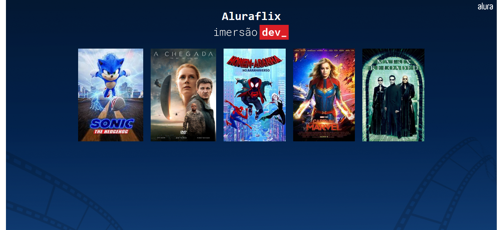

# Aluraflix
Nesta aula vamos aprender sobre estruturas de dados e como trabalhar com listas. Vamos criar uma lista com o filme preferido de cada pessoa e exibir os pôsteres de cada filmes na tela do navegador, seguindo as boas práticas de programação.

  

